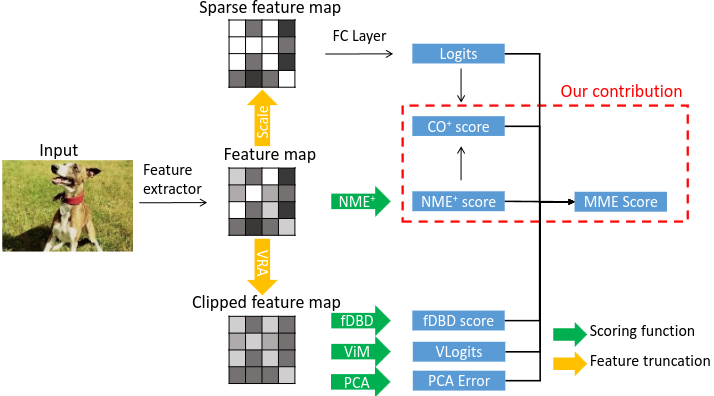
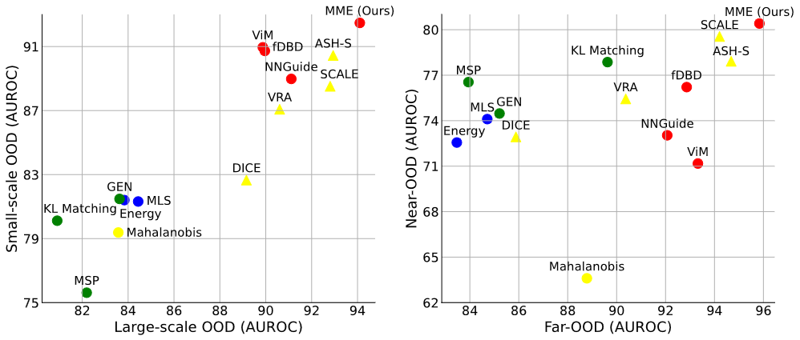

## Multi-Method Ensemble for Out-of-Distribution Detection
The official implementation of our BMVC 2025 paper:
[Multi-Method Ensemble for Out-of-Distribution Detection](https://arxiv.org/abs/2508.21463).

#### Abstract
*Detecting out-of-distribution (OOD) samples is essential for neural networks operating in open-world settings, particularly in safety-critical applications. Existing methods have improved OOD detection by leveraging two main techniques: feature truncation, which increases the separation between in-distribution (ID) and OOD samples, and scoring functions, which assign scores to distinguish between ID and OOD data. However, most approaches either focus on a single family of techniques or evaluate their effectiveness on a specific type of OOD dataset, overlooking the potential of combining multiple existing solutions. Motivated by this observation, we theoretically and empirically demonstrate that state-of-the-art feature truncation and scoring functions can be effectively combined. Moreover, we show that aggregating multiple scoring functions enhances robustness against various types of OOD samples. Based on these insights, we propose the Multi-Method Ensemble (MME) score, which unifies state-of-the-art OOD detectors into a single, more effective scoring function. Extensive experiments on both large-scale and small-scale benchmarks, covering near-OOD and far-OOD scenarios, show that MME significantly outperforms recent state-of-the-art methods across all benchmarks. Notably, using the BiT model, our method achieves an average FPR95 of 27.57% on the challenging ImageNet-1K benchmark, improving performance by 6% over the best existing baseline.*



### DataSets

Dataset source can be downloaded here.

- [ImageNet](https://www.image-net.org/). The ILSVRC 2012 dataset as In-distribution (ID) dataset. The training subset we used is [this file](datalists/imagenet2012_train_random_200k.txt).
- [OpenImage-O](https://github.com/openimages/dataset/blob/main/READMEV3.md). The OpenImage-O dataset is a subset of the OpenImage-V3 testing set. The filelist is [here](datalists/openimage_o.txt). Please refer to [our paper of ViM](http://ooddetection.github.io) for details of dataset construction.
- [Texture](https://www.robots.ox.ac.uk/~vgg/data/dtd/). We rule out four classes that coincides with ImageNet. The filelist used in the paper is [here](datalists/texture.txt).
- [iNaturalist](https://arxiv.org/pdf/1707.06642.pdf). Follow the instructions in the [link](https://github.com/deeplearning-wisc/large_scale_ood) to prepare the iNaturalist OOD dataset.
- [ImageNet-O](https://github.com/hendrycks/natural-adv-examples). Follow the guide to download the ImageNet-O OOD dataset.

Most datasets can be download with the script download.sh from [ASH](https://github.com/andrijazz/ash) or [OpenOOD](https://github.com/Jingkang50/OpenOOD)

```bash
mkdir data
cd data
ln -s /path/to/imagenet imagenet
ln -s /path/to/openimage_o openimage_o
ln -s /path/to/texture texture
ln -s /path/to/inaturalist inaturalist
ln -s /path/to/imagenet_o imagenet_o
cd ..
```

### Pretrained Model Preparation

#### VIT

1. install mmpretrain
2. download checkpoint
   ```bash
   mkdir checkpoints
   cd checkpoints
   wget https://download.openmmlab.com/mmclassification/v0/vit/finetune/vit-base-p16_in21k-pre-3rdparty_ft-64xb64_in1k-384_20210928-98e8652b.pth
   cd ..
   ```
3. extract features
   ```bash
   ./extract_feature_vit.py data/imagenet outputs/vit_imagenet_val.pkl --img_list datalists/imagenet2012_val_list.txt
   ./extract_feature_vit.py data/imagenet outputs/vit_train_200k.pkl --img_list datalists/imagenet2012_train_random_200k.txt
   ./extract_feature_vit.py data/openimage_o outputs/vit_openimage_o.pkl --img_list datalists/openimage_o.txt
   ./extract_feature_vit.py data/texture outputs/vit_texture.pkl --img_list datalists/texture.txt
   ./extract_feature_vit.py data/inaturalist outputs/vit_inaturalist.pkl
   ./extract_feature_vit.py data/imagenet_o outputs/vit_imagenet_o.pkl
   ./extract_feature_vit.py data/cifar10 outputs/vit_cifar10_train.pkl --img_list datalists/cifar10_train.txt
   ./extract_feature_vit.py data/cifar10 outputs/vit_cifar10_test.pkl --img_list datalists/cifar10_test.txt
   ```
4. extract w and b in fc
   ```bash
   ./extract_feature_vit.py a b --fc_save_path outputs/vit_fc.pkl
   ```
5. evaluation
   ```bash
   ./benchmark.py outputs/vit_fc.pkl outputs/vit_train_200k.pkl outputs/vit_imagenet_val.pkl outputs/vit_openimage_o.pkl outputs/vit_texture.pkl outputs/vit_inaturalist.pkl outputs/vit_imagenet_o.pkl
   ./benchmark.py outputs/vit_fc.pkl outputs/vit_cifar10_train.pkl outputs/vit_cifar10_test.pkl outputs/vit_openimage_o.pkl outputs/vit_texture.pkl outputs/vit_inaturalist.pkl outputs/vit_imagenet_o.pkl
   ```

#### BIT

1. download checkpoint
   ```bash
   mkdir checkpoints
   cd checkpoints
   wget https://storage.googleapis.com/bit_models/BiT-S-R101x1.npz
   cd ..
   ```
2. extract features
   ```bash
   ./extract_feature_bit.py data/imagenet outputs/bit_imagenet_val.pkl --img_list datalists/imagenet2012_val_list.txt
   ./extract_feature_bit.py data/imagenet outputs/bit_train_200k.pkl --img_list datalists/imagenet2012_train_random_200k.txt
   ./extract_feature_bit.py data/openimage_o outputs/bit_openimage_o.pkl --img_list datalists/openimage_o.txt
   ./extract_feature_bit.py data/texture outputs/bit_texture.pkl --img_list datalists/texture.txt
   ./extract_feature_bit.py data/inaturalist outputs/bit_inaturalist.pkl
   ./extract_feature_bit.py data/imagenet_o outputs/bit_imagenet_o.pkl
   ```
3. extract w and b in fc
   ```bash
   ./extract_feature_bit.py a b --fc_save_path outputs/bit_fc.pkl
   ```
4. evaluation
   ```bash
   ./benchmark.py outputs/bit_fc.pkl outputs/bit_train_200k.pkl outputs/bit_imagenet_val.pkl outputs/bit_openimage_o.pkl outputs/bit_texture.pkl outputs/bit_inaturalist.pkl outputs/bit_imagenet_o.pkl
   ```

### Results

   
### Cite
If you found this work useful in your research, please consider citing:
```
@article{rakotoarivony2025multi,
  title={Multi-Method Ensemble for Out-of-Distribution Detection},
  author={Rakotoarivony, Lucas},
  journal={arXiv preprint arXiv:2508.21463},
  year={2025}
}
```


### Acknowledgement

Part of the code is highly inspired from [ViM](https://github.com/haoqiwang/vim) repo. Part of the code is inspired from [OpenOOD](https://github.com/Jingkang50/OpenOOD) and [MOS](https://github.com/deeplearning-wisc/large_scale_ood) repo.
